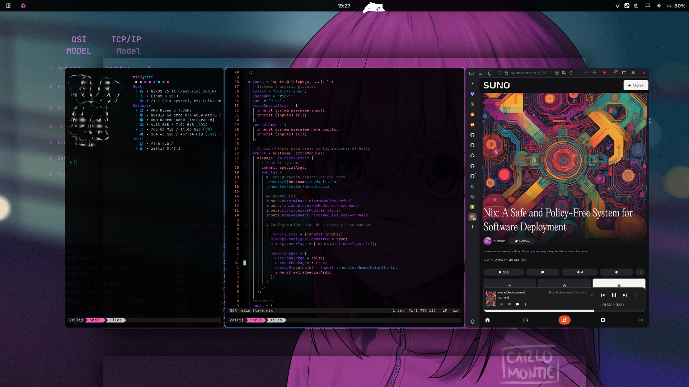
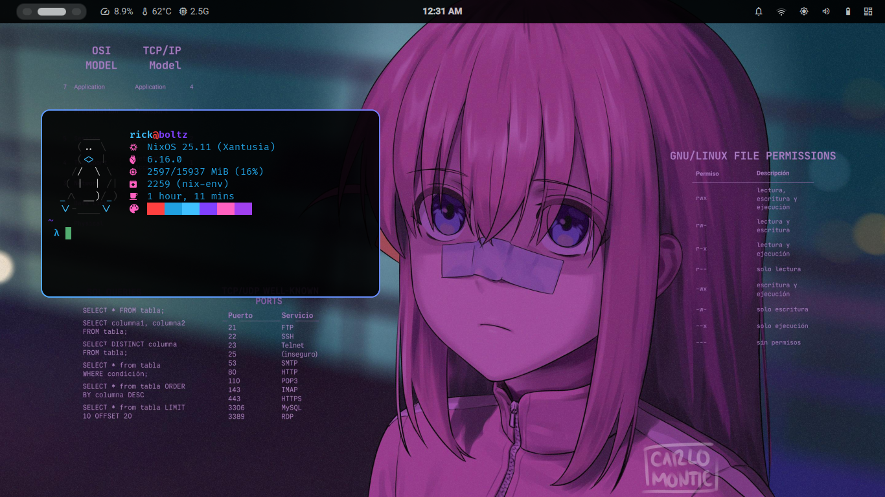

<h1 align="center">:snowflake: MarsOS :snowflake:</h1>
<p align="center"> 
 MarsOS is a simple way to replicate my setup on any NixOS system via a Flake.
</p>




- Wallpaper: [Bochi Rock Linux](https://imgur.com/bochi-rock-linux-wallpaper-mO5tavs)
- OG Wallpaper: [Bocchi Runner 2049 by Carlo Montie](https://www.pixiv.net/en/artworks/108083186) 

<details>
<summary>Environment Software</summary>

|                             | NixOS(Wayland)                                  |
| --------------------------- | ----------------------------------------------- |
| **Window Manager**          | [Niri][Niri]                                    |
| **Terminal Emulator**       | [Wezterm][Wezterm] + [Zellij][Zellij]           |
| **Bar**                     | [Ironbar][Ironbar]                              |
| **Application Launcher**    | [Walker][Walker]                                |
| **Notification Daemon**     | [SwayNC][SwayNC]                                |
| **Session Manager**         | [GreetD][GreetD] + [TuiGreet][TuiGreet]         |
| **Network Management Tool** | [IWD][IWD] + [NetworkManager][NetworkManager]   |
| **System Resource Monitor** | [Bottom][Bottom] & [Zenith][Zenith]             |
| **File Manager**            | [Yazi][Yazi] & [Nautilus][Nautilus]             |
| **Shell**                   | [Fish][Fish]                                    |
| **Text Editor**             | [Helix][Helix]                                  |
| **Fonts**                   | [Nerd fonts][Nerd fonts]                        |
| **Image Viewer**            | [IMV][IMV]                                      |
| **Multimedia Player**       | [MPV][MPV]                                      |

</details>


## Estructura de directorios resultante:
```
MarsOS/
├── assets
│   ├── ascii-art
│   └── wallpapers
├── hosts/
│   ├── {host}
│   │   ├── default.nix
│   │   └── disko.nix
│   ├── host.md
│   └── config.md
├── modules/
├── flake.nix
├── flake.lock
└── shell.nix
   ```

## Installation Guide

### Prerequisites
- A bootable NixOS ISO (Minimal installation recommended)
- Internet connection

### Steps

1. **Clone the repository:**
```bash
   nix run nixpkgs#git -- clone https://github.com/RickMars-Tech/MarsOS.git
```

2. **Navigate to the directory and apply Disko formatting:**
```bash
   cd MarsOS/
   sudo nix --experimental-features "nix-command flakes" run github:nix-community/disko/latest -- --mode destroy,format,mount hosts/<host>/disko.nix
```
   > **Note:** Replace `<host>` with your actual hostname (e.g., `boltz`, `rift`, or `crest`)

3. **Copy the Flake to `/mnt/etc/nixos/` and build the system:**
```bash
   sudo mkdir -p /mnt/etc/nixos
   sudo cp -r ~/MarsOS /mnt/etc/nixos/
   sudo nixos-install --flake /mnt/etc/nixos/MarsOS#<host>
```
   > **Note:** Replace `<host>` with your chosen hostname

4. **Reboot and enjoy!**

## Documentation

- **[Creating Custom Hosts](./hosts/host.md)** - Learn how to create your own host configurations
- **[Configuration Options](./hosts/config.md)** - Complete reference of all Mars modules and options

## Important Notes

1. **Personal Configuration:** This Flake is specifically tailored for my systems (boltz, rift, and crest). You're welcome to use it as a base, modify the configuration files, or copy individual components that suit your needs.

2. **Boot Loader:** This configuration uses systemd-boot and Lanzaboote as the default boot loader. GRUB support is not included, so you'll need to configure it manually if you prefer GRUB.

3. **Installation Environment:** For best results, install from a minimal NixOS environment without a pre-installed desktop environment.

## Credits & References

Special thanks to these excellent configurations that inspired and taught me so much:

- **[Gvolpe]** - Zaphkiel configuration
- **[Tyler Kelley]** - ZaneyOS
- **[Liassica]** - NixOS config
- **[Ryan Yin]** - NixOS and Flakes book

<!----------------------------------{ Thanks }--------------------------------->
[Gvolpe]: https://github.com/Rexcrazy804/Zaphkiel
[Tyler Kelley]: https://gitlab.com/Zaney/zaneyos
[Liassica]: https://codeberg.org/Liassica/nixos-config
[Ryan Yin]: https://github.com/ryan4yin/nixos-and-flakes-book

<!--------------------------------{ Components }------------------------------->
[Niri]: https://github.com/YaLTeR/niri
[Wezterm]: https://wezterm.org/
[Ironbar]: https://github.com/JakeStanger/ironbar
[Zellij]: https://zellij.dev/
[Walker]: https://github.com/abenz1267/walker
[SwayNC]: https://github.com/ErikReider/SwayNotificationCenter
[GreetD]: https://sr.ht/~kennylevinsen/greetd/
[TuiGreet]: https://github.com/apognu/tuigreet
[IWD]: https://git.kernel.org/pub/scm/network/wireless/iwd.git
[NetworkManager]: https://gitlab.freedesktop.org/NetworkManager/NetworkManager
[Bottom]: https://github.com/ClementTsang/bottom
[Zenith]: https://github.com/bvaisvil/zenith
[Yazi]: https://github.com/sxyazi/yazi
[Nautilus]: https://apps.gnome.org/Nautilus/
[Fish]: https://fishshell.com/
[Helix]: https://helix-editor.com/
[Nerd fonts]: https://www.nerdfonts.com/
[IMV]: https://sr.ht/~exec64/imv/
[MPV]: https://mpv.io/
