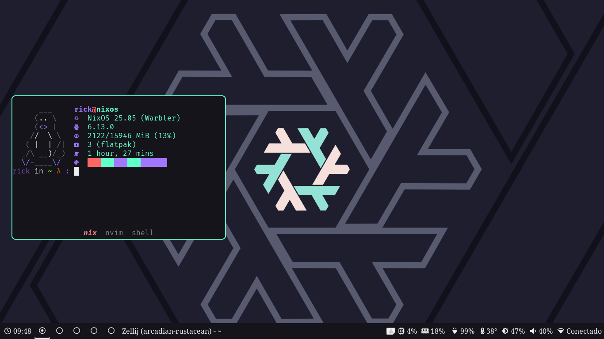
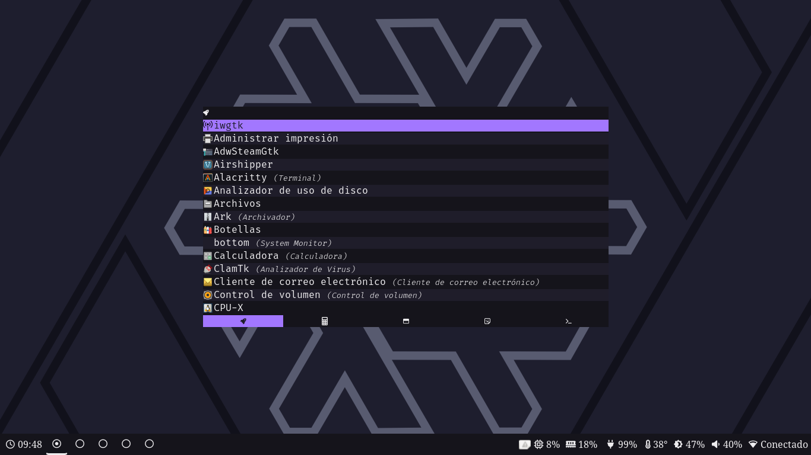
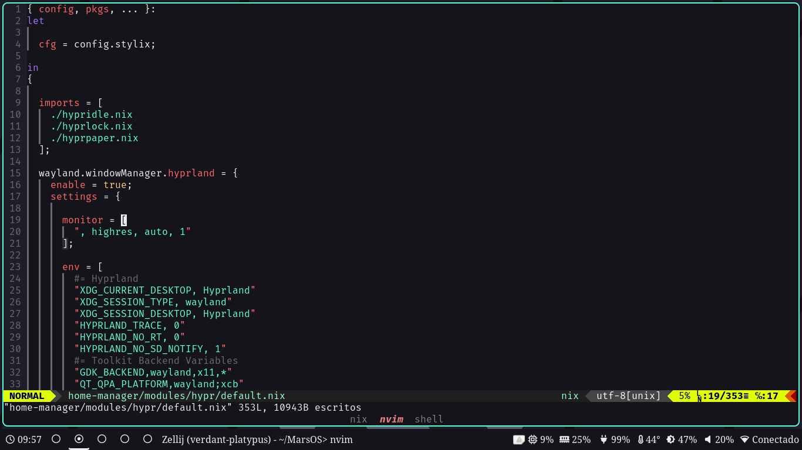
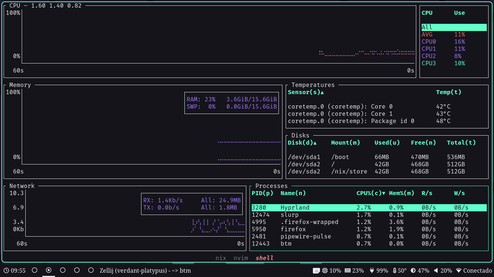

<h1 align="center">:snowflake: MarsOS :snowflake:</h1>
<p align="center"> 
 MarsOS is a simple way to replicate my setup on any NixOS system via a Flake.

 [](https://builtwithnix.org)
<p/>

</div>









## Components

|                             | NixOS(Wayland)                                                                                                      |
| --------------------------- | ------------------------------------------------------------------------------------------------------------------- |
| **Window Manager**          | [Hyprland][Hyprland]                                                                                                        |
| **Terminal Emulator**       | [Zellij][Zellij] + [Alacritty][Alacritty]                                                                                     |
| **Bar**                     | [Waybar][Waybar]                                                                                                    |
| **Application Launcher**    | [Fuzzel][Fuzzel]                                                                                                    |
| **Notification Daemon**     | [Dunst][Dunst]                                                                                                      |
| **Display Manager**         | [GreetD][GreetD] + [TuiGreet][TuiGreet]                                                                             |
| **network management tool** | [Iwgtk][Iwgtk]                                                                                                      |
| **System resource monitor** | [Bottom][Bottom]                                                                                                    |
| **File Manager**            | [Yazi][Yazi] & [Nautilus][Nautilus]                                                                                 |
| **Shell**                   | [Nushell][Nushell] + [Oh-My-Posh][Oh-My-Posh]                                                                       |
| **Media Player**            | [MPV][MPV]                                                                                                          |
| **Text Editor**             | [Neovim][Neovim]                                                                                                    |
| **Fonts**                   | [Nerd fonts][Nerd fonts]                                                                                            |
| **Image Viewer**            | [IMV][IMV]                                                                                                          |

# Guide to Setup
<br>

Run this command to ensure Git are installed:
```bash
nix-shell -p git
```

Clone the Repo:
```bash
git clone https://github.com/RickMars-Tech/MarsOS.git
cd MarsOS
```

Give permissions to the script and Run it:
```bash
sudo chmod +x setup
./setup
```
<br>


# Important.
1. This Flake is built specifically for Thinkpad/Intel systems, later I will add more modularity to support AMD systems but at the moment it should only be used for systems similar to mine (I use a Thinkpad T420) to avoid errors.
2. The NixOS base must have been installed using GPT and UEFI since by default only Systemd-boot is supported, for GRUB you will have to edit the flake.
3. Preferably Install a Minimal environment without DE.


# References

Other configurations that I have learned a lot from:

**[Tyler Kelley ]**

**[Liassica]**

**[Ryan Yin]**

<!----------------------------------{ Thanks }--------------------------------->
[Tyler Kelley ]: https://gitlab.com/Zaney/zaneyos
[Liassica]: https://codeberg.org/Liassica/nixos-config
[Ryan Yin]: https://github.com/ryan4yin/nixos-and-flakes-book

<!--------------------------------{ Components }------------------------------->
[Hyprland]: https://github.com/hyprwm/Hyprland
[Zellij]: https://github.com/zellij-org/zellij
[Alacritty]: https://alacritty.org/
[Waybar]: https://github.com/Alexays/Waybar
[Fuzzel]: https://codeberg.org/dnkl/fuzzel
[Dunst]: https://github.com/dunst-project/dunst
[GreetD]: https://sr.ht/~kennylevinsen/greetd/
[TuiGreet]: https://github.com/apognu/tuigreet
[Iwgtk]: https://github.com/J-Lentz/iwgtk
[Bottom]: https://github.com/ClementTsang/bottom
[Yazi]: https://github.com/sxyazi/yazi
[Nautilus]: https://github.com/GNOME/nautilus
[Nushell]: https://github.com/nushell/nushell
[Oh-My-Posh]: https://github.com/jandedobbeleer/oh-my-posh
[MPV]: https://github.com/mpv-player/mpv
[Neovim]: https://github.com/neovim/neovim
[Nerd fonts]: https://github.com/ryanoasis/nerd-fonts
[IMV]: https://sr.ht/~exec64/imv/
