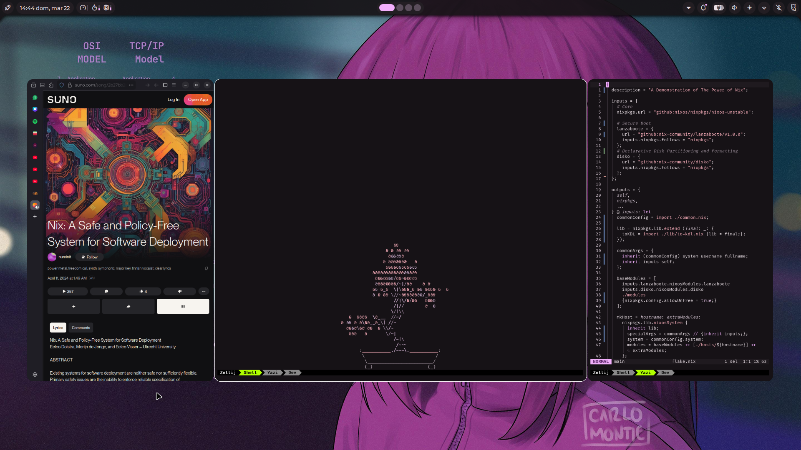
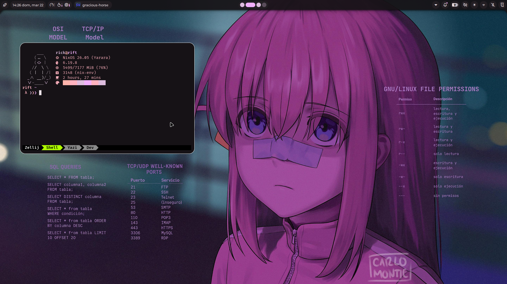
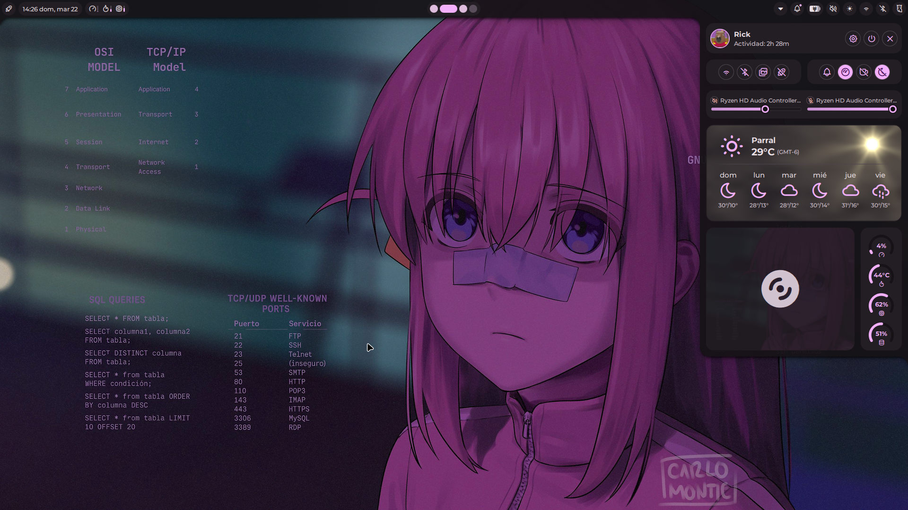

<h1 align="center">:snowflake: MarsOS :snowflake:</h1>
<p align="center">
   MarsOS is a simple way to replicate my setup on any NixOS system via a Flake.
</p>





- Wallpaper: [Bloom Dark by dpcdpc11](https://www.reddit.com/r/wallpapers/comments/102bz2o/bloom_dark_by_dpcdpc11_5120x2880/?tl=es-419)

## Design Philosophy

Based on [linuxmobile][linuxmobile]'s [Shin][Shin] and [olafkfreund][olafkfreund]'s [nixos-template][nixos-template] Configuration Structure, with a Full NixOS approach without relying on Home-Manager, preferring to use custom modules for software such as Niri or for simpler hardware configurations without relying on so many inputs in the Flake

<details>
<summary>Environment Software</summary>

|                             | Full Wayland Btw                                    |
| --------------------------- | --------------------------------------------------- |
| **Window Manager**          | [Niri][Niri] + [Noctalia][Noctalia]                 |
| **Session Manager**         | [SDDM][SDDM] + [SDDM-Astronaut][SDDM-Astronaut]     |
| **Terminal Emulator**       | [Wezterm][Wezterm] + [Zellij][Zellij]               |
| **Network Management Tool** | [IWD][IWD] + [NetworkManager][NetworkManager]       |
| **System Resource Monitor** | [Bottom][Bottom] & [Mission Center][Mission Center] |
| **File Manager**            | [Yazi][Yazi] & [Nautilus][Nautilus]                 |
| **Polkit**                  | [Soteria][Soteria]                                  |
| **Shell**                   | [Fish][Fish] + [Starship][Starship]                 |
| **Text Editor**             | [Helix][Helix]                                      |
| **Fonts**                   | [Nerd fonts][Nerd fonts]                            |
| **Image Viewer**            | [Swayimg][Swayimg]                                  |
| **Multimedia Player**       | [MPV][MPV]                                          |

</details>

<details>
<summary>Flake Directory Structure</summary>

```
MarsOS/
├── assets/
│   ├── ascii-art
│   └── wallpapers/
├── hosts/{host}/
│   │     ├── default.nix
│   │     └── disko.nix
│   ├── host.md
│   └── config.md
├── modules/
├── flake.nix
├── flake.lock
└── shell.nix
```

</details>

## Installation Guide

### Prerequisites

- A bootable NixOS ISO (Minimal installation recommended)
- Internet connection

### Steps

1. **Clone the repository:**

```bash
   nix run nixpkgs#git -- clone https://github.com/RickMars-Tech/MarsOS.git
```

2. **Navigate to the directory and apply Disko formatting:**

```bash
   cd MarsOS/
   sudo nix --experimental-features "nix-command flakes" run github:nix-community/disko/latest -- --mode destroy,format,mount hosts/<host>/disko.nix
```

> **Note:** Replace `<host>` with your actual hostname (e.g., `boltz`, `rift`, or `crest`)

3. **Copy the Flake to `/mnt/etc/nixos/` and build the system:**

```bash
   sudo mkdir -p /mnt/etc/nixos
   sudo cp -r ~/MarsOS /mnt/etc/nixos/
   sudo nixos-install --flake /mnt/etc/nixos/MarsOS#<host>
```

> **Note:** Replace `<host>` with your chosen hostname

4. **Reboot and enjoy!**

## Documentation

- **[Creating Custom Hosts](./hosts/host.md)** - Learn how to create your own host configurations
- **[Configuration Options](./hosts/config.md)** - Complete reference of all Mars modules and options

## Important Notes

1. **Personal Configuration:** This Flake is specifically tailored for my systems (boltz, rift, and crest). You're welcome to use it as a base, modify the configuration files, or copy individual components that suit your needs.

2. **Boot Loader:** This configuration uses systemd-boot and Lanzaboote as the default boot loader. GRUB support is not included, so you'll need to configure it manually if you prefer GRUB.

3. **Installation Environment:** For best results, install from a minimal NixOS environment without a pre-installed desktop environment.

## Credits & References

Special thanks to these excellent configurations that inspired and taught me so much:

- **[Gvolpe]** - Zaphkiel configuration.
- **[Tyler Kelley]** - ZaneyOS.
- **[Liassica]** - NixOS config.
- **[Ryan Yin]** - NixOS and Flakes book.
- **[shin]** - An elegant NixOS environment designed.
- **[nixos-template]** - A template to start you nixos journey.

<!----------------------------------{ Thanks }--------------------------------->

[Gvolpe]: https://github.com/Rexcrazy804/Zaphkiel
[Tyler Kelley]: https://gitlab.com/Zaney/zaneyos
[Liassica]: https://codeberg.org/Liassica/nixos-config
[Ryan Yin]: https://github.com/ryan4yin/nixos-and-flakes-book
[linuxmobile]: https://github.com/linuxmobile
[shin]: https://github.com/linuxmobile/shin
[olafkfreund]: https://github.com/olafkfreund
[nixos-template]: https://github.com/olafkfreund/nixos-template

<!--------------------------------{ Components }------------------------------->

[Niri]: https://github.com/YaLTeR/niri
[Noctalia]: https://noctalia.dev/
[Wezterm]: https://wezterm.org/
[Zellij]: https://zellij.dev/
[SDDM]: https://github.com/sddm/sddm
[SDDM-Astronaut]: https://github.com/Keyitdev/sddm-astronaut-theme
[IWD]: https://git.kernel.org/pub/scm/network/wireless/iwd.git
[NetworkManager]: https://gitlab.freedesktop.org/NetworkManager/NetworkManager
[Bottom]: https://github.com/ClementTsang/bottom
[Mission Center]: https://gitlab.com/mission-center-devs/mission-center
[Yazi]: https://github.com/sxyazi/yazi
[Nautilus]: https://apps.gnome.org/Nautilus/
[Soteria]: https://github.com/ImVaskel/soteria
[Fish]: https://fishshell.com/
[Starship]: https://starship.rs/
[Helix]: https://helix-editor.com/
[Nerd fonts]: https://www.nerdfonts.com/
[Swayimg]: https://github.com/artemsen/swayimg
[MPV]: https://mpv.io/
