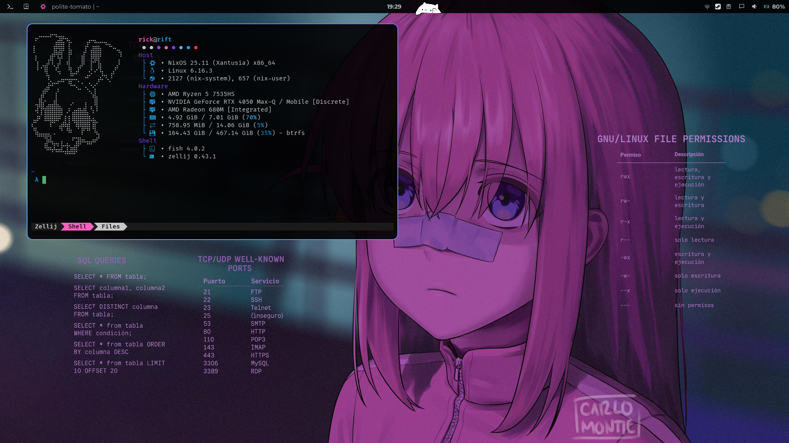

<h1 align="center">:snowflake: MarsOS :snowflake:</h1>
<p align="center"> 
 MarsOS is a simple way to replicate my setup on any NixOS system via a Flake.

<p/>

</div>




- Wallpaper: [Bochi Rock Linux](https://imgur.com/bochi-rock-linux-wallpaper-mO5tavs)
- OG Wallpaper: [Bocchi Runner 2049 by Carlo Montie](https://www.pixiv.net/en/artworks/108083186) 

<details>
<summary>Environment Software</summary>
|                             | NixOS(Wayland)                                                                                                      |
| --------------------------- | ------------------------------------------------------------------------------------------------------------------- |
| **Window Manager**          | [Niri][Niri]                                                                                                        |
| **Terminal Emulator**       | [Wezterm][Wezterm]                                                                                                  |
| **Bar**                     | [Quickshell][Quickshell]                                                                                            |
| **Application Launcher**    | [Fuzzel][Fuzzel]                                                                                                    |
| **Notification Daemon**     | [Dunst][Dunst]                                                                                                      |
| **Display Manager**         | [GreetD][GreetD] + [TuiGreet][TuiGreet]                                                                             |
| **Network Management Tool** | [IWD][IWD] + [NetworkManager][NetworkManager]                                                                       |
| **System resource monitor** | [Bottom][Bottom]                                                                                                    |
| **File Manager**            | [Yazi][Yazi] & [PCManFM][PCManFM]                                                                                   |
| **Shell**                   | [Fish][Fish]                                                                                                        |
| **Media Player**            | [MPV][MPV]                                                                                                          |
| **Text Editor**             | [Helix][Helix]                                                                                                      |
| **Fonts**                   | [Nerd fonts][Nerd fonts]                                                                                            |
| **Image Viewer**            | [IMV][IMV]                                                                                                          |
</details>

# Guide to Setup
<br>

Install git with Nix-shell:
```bash
nix shell nixpkgs#git
```

Clone the Repo:
```bash
git clone https://github.com/RickMars-Tech/MarsOS.git
```

Update the Flake:
```bash
sudo nix flake update
```

Change Directorie and Generate Hardware Config:
```bash
cd MarsOS/
sudo nixos-generate-config --show-hardware-config > ./modules/hardware.nix
```

Rebuild System:
```bash
sudo nixos-rebuild boot --flake .#{host}
```

The script is "Experimental", so I don't recommend it, but, if you want to use it just give permissions:
```bash
sudo chmod +x setup
./setup
```

<br>


# Important.
1. This Flake is created specifically for my systems (boltz and rift), you can create your own configuration through the options I create, editing configuration files and/or creating your own modifications, feel free to copy/take the configurations you want.
2. I use the Default Boot Loader Systemd-boot, I have no plans to create modules/configurations for GRUB, so you will have to configure it yourself if you want to use it.
3. Preferably Install a Minimal environment without DE.


# References

Configurations that have inspired and taught me a lot (Sorry for stealing from you guys):

**[Gvolpe]**

**[Tyler Kelley]**

**[Liassica]**

**[Ryan Yin]**

<!----------------------------------{ Thanks }--------------------------------->
[Gvolpe]: https://github.com/Rexcrazy804/Zaphkiel
[Tyler Kelley]: https://gitlab.com/Zaney/zaneyos
[Liassica]: https://codeberg.org/Liassica/nixos-config
[Ryan Yin]: https://github.com/ryan4yin/nixos-and-flakes-book

<!--------------------------------{ Components }------------------------------->
[Niri]: https://github.com/YaLTeR/niri
[Wezterm]: https://wezterm.org/
[Quickshell]: https://quickshell.org/
[Fuzzel]: https://codeberg.org/dnkl/fuzzel
[Dunst]: https://github.com/dunst-project/dunst
[GreetD]: https://sr.ht/~kennylevinsen/greetd/
[TuiGreet]: https://github.com/apognu/tuigreet
[IWD]: https://git.kernel.org/pub/scm/network/wireless/iwd.git
[NetworkManager]: https://gitlab.freedesktop.org/NetworkManager/NetworkManager
[Bottom]: https://github.com/ClementTsang/bottom
[Yazi]: https://github.com/sxyazi/yazi
[PCManFM]: https://blog.lxde.org/category/pcmanfm/
[Fish]: https://fishshell.com/
[MPV]: https://github.com/mpv-player/mpv
[Helix]: https://helix-editor.com/
[Nerd fonts]: https://www.nerdfonts.com/
[IMV]: https://sr.ht/~exec64/imv/
[Nix-ArtWork]: https://github.com/NixOS/nixos-artwork
